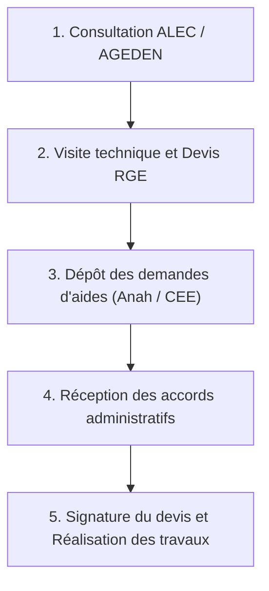

Financer l’installation de sa pompe à chaleur en Isère peut ressembler à un parcours du combattant. Pourtant, grâce au cumul des dispositifs nationaux (MaPrimeRénov', Primes CEE) et des coups de pouce locaux, les foyers aux revenus modestes peuvent obtenir la prise en charge de **jusqu'à 90 % du montant total de leur facture**, réduisant le reste à charge à quelques milliers d’euros seulement.

Pour sécuriser vos subventions sans commettre d’erreur éliminatoire, voici le mode d’emploi administratif complet, ainsi que les organismes isérois incontournables à consulter.

---

## 1. Vos Interlocuteurs de Proximité en Isère : ALEC & AGEDEN

Avant même de solliciter des artisans ou de signer le moindre document, il est essentiel d'obtenir un conseil technique et financier neutre. En Isère, le service public **France Rénov'** est animé par deux structures territoriales de référence :

### A. Si vous habitez la Métropole Grenobloise : L'ALEC Grenoble
L'**ALEC** (Agence Locale de l'Énergie et du Climat) accompagne les résidents des communes de Grenoble-Alpes Métropole. Elle propose :
* Un conseil gratuit et personnalisé sur les solutions techniques (Air-Eau, Air-Air, Géothermie).
* L'accès au dispositif **Mur|Mur**, qui propose des subventions bonifiées pour les rénovations performantes et globales de maisons ou copropriétés.
* *Site officiel* : [alec-grenoble.org](https://www.alec-grenoble.org)

### B. Si vous habitez le reste de l'Isère : L'AGEDEN
L'**AGEDEN** (Association pour la gestion des énergies dans le département de l'Isère) conseille les foyers situés en dehors de l'agglomération grenobloise (Grésivaudan, Nord-Isère, Bièvre-Valloire, Trièves, etc.).
* Ils animent des permanences info-énergie locales au plus proche de chez vous.
* Le portail **infoenergie38.org** met à disposition des simulateurs et des listes d'artisans audités.
* *Site officiel* : [infoenergie38.org](https://infoenergie38.org)

---

## 2. Le Panier d'Aides Cumulables en 2026

Pour l'installation d'une pompe à chaleur RGE (de classe Air-Eau ou Géothermique), le plan de financement s'appuie sur quatre leviers nationaux cumulables :

1. **MaPrimeRénov' (Anah)** : Aide forfaitaire versée par l'Agence Nationale de l'Habitat. Elle est calculée selon votre tranche de ressources (Bleu, Jaune, Violet) et atteint **jusqu'à 9 000 €** pour une PAC Air-Eau, et **jusqu'à 11 000 €** pour de la géothermie.
2. **La Prime CEE (Certificats d'Économie d'Énergie)** : Versée par les fournisseurs d'énergie (EDF, Total, distributeurs de carburant) sous forme de virement. Elle est accessible à tous les ménages et s'élève généralement de **2 500 € à 4 500 €**.
3. **L'Éco-PTZ (Prêt à Taux Zéro)** : Un prêt bancaire sans aucun intérêt allant **jusqu'à 30 000 €** pour étaler le financement de votre reste à charge sur une durée maximale de 15 ans.
4. **La TVA Réduite à 5,5 %** : Appliquée d’office sur la facture de votre chauffagiste RGE pour l'achat du matériel et de la main-d'œuvre.

---

## 3. Le Parcours Administratif en 5 Étapes Chronologiques

Le respect de la chronologie des démarches est la règle d’or de la rénovation énergétique. **L'inversion de ces étapes entraîne le rejet systématique de vos dossiers d'aides.**

### Étape 1 : Le Conseil Initital
Contactez l'ALEC ou l'AGEDEN pour valider l'opportunité thermique de la PAC et faire une première simulation de votre reste à charge réel.

### Étape 2 : Les Devis RGE
Faites réaliser des visites techniques sur site par des entreprises certifiées **RGE QualiPAC**. Un devis de pompe à chaleur doit obligatoirement mentionner :
* La marque, le modèle précis et la puissance de la PAC.
* Son efficacité énergétique saisonnière (ETAS) ou son COP.
* Le label RGE en cours de validité de l'entreprise.

### Étape 3 : Le Dépôt des Dossiers
Déposez votre demande de Prime CEE auprès du fournisseur d'énergie choisi, **puis** créez votre compte sur le portail `maprimerenov.gouv.fr` pour soumettre votre devis non signé.

### Étape 4 : L'Accord des Organismes
Attendez la notification d'attribution de l'Anah et l'accord de la prime CEE. **C'est seulement à ce moment que vous avez le droit de signer le devis et de verser un acompte à l'artisan.**

### Étape 5 : Les Travaux & Le Versement
Faites installer l'équipement. Une fois le chantier validé et la facture acquittée, déposez vos justificatifs sur les plateformes pour obtenir le virement de vos primes sous quelques semaines.

> [!WARNING]
> **Piège administratif fréquent :** Ne signez jamais un devis et ne versez aucun acompte avant d'avoir obtenu la confirmation écrite de la prise en compte de vos demandes d'aides sur les plateformes en ligne. Tout début d'exécution ou engagement financier anticipé invalidera définitivement votre éligibilité.
